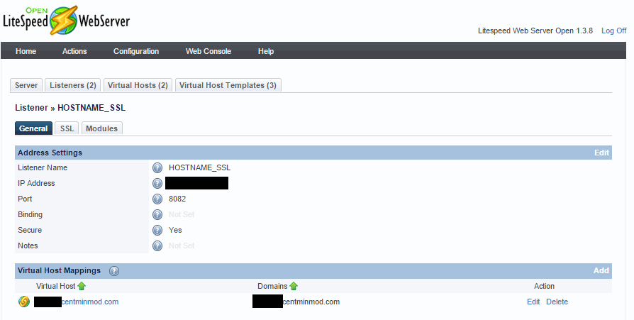
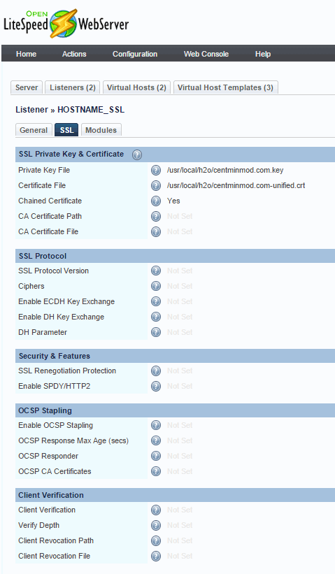
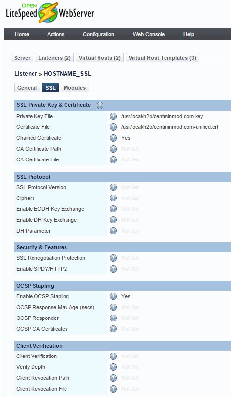
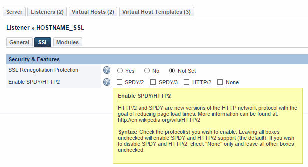
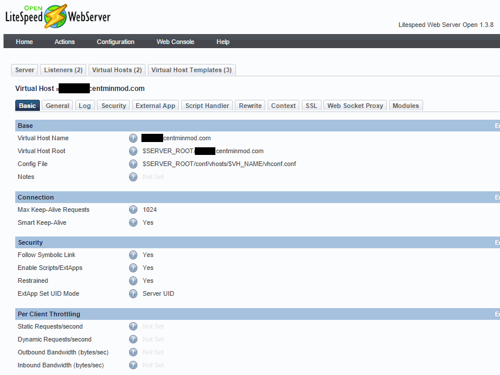
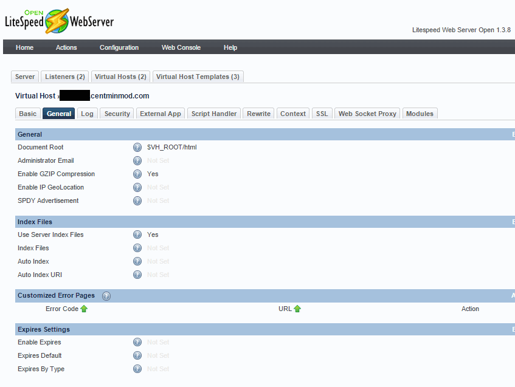

Quick OpenLiteSpeed 1.3.8 HTTP/2 support check
===============================================

* http://open.litespeedtech.com/mediawiki/
* http://open.litespeedtech.com/mediawiki/index.php/Help:Repositories
* http://open.litespeedtech.com/mediawiki/index.php/Help:Install:OpenLiteSpeed_with_HTTP2_Installation_Notes

curl check for OpenLiteSpeed 1.3.8 on port 8082

    curl -I https://OPENLITESPEEDHOST.centminmod.com:8082/
    HTTP/1.1 200 OK
    etag: "ed9-5508fbfa-6633c"
    last-modified: Wed, 18 Mar 2015 04:15:54 GMT
    content-type: text/html
    content-length: 3801
    accept-ranges: bytes
    date: Wed, 18 Mar 2015 04:20:13 GMT
    server: LiteSpeed
    connection: close

[cipherscan](https://github.com/jvehent/cipherscan) check

    ./cipherscan OPENLITESPEEDHOST.centminmod.com:8082
    .........
    Target: OPENLITESPEEDHOST.centminmod.com:8082
    
    prio  ciphersuite                  protocols                    pfs_keysize
    1     ECDHE-RSA-AES256-GCM-SHA384  TLSv1.2                      ECDH,P-256,256bits
    2     ECDHE-RSA-AES128-GCM-SHA256  TLSv1.2                      ECDH,P-256,256bits
    3     ECDHE-RSA-AES256-SHA384      TLSv1.2                      ECDH,P-256,256bits
    4     ECDHE-RSA-AES128-SHA256      TLSv1.2                      ECDH,P-256,256bits
    5     ECDHE-RSA-RC4-SHA            SSLv3,TLSv1,TLSv1.1,TLSv1.2  ECDH,P-256,256bits
    6     ECDHE-RSA-AES256-SHA         SSLv3,TLSv1,TLSv1.1,TLSv1.2  ECDH,P-256,256bits
    7     ECDHE-RSA-AES128-SHA         SSLv3,TLSv1,TLSv1.1,TLSv1.2  ECDH,P-256,256bits
    8     RC4-SHA                      SSLv3,TLSv1,TLSv1.1,TLSv1.2
    
    Certificate: trusted, 2048 bit, sha256WithRSAEncryption signature
    TLS ticket lifetime hint: 100800
    OCSP stapling: not supported
    Server side cipher ordering

Using [nghttp2](https://nghttp2.org/) bundled h2load HTTP/2 load tester doesn't seem to detect supported HTTP/2 protocol for OpenLiteSpeed 1.3.8  on port 8082 ? could be related to OpenLiteSpeed 1.3.8's OpenSSL version is <OpenSSL 1.0.2 so doesn't support ALPN TLS extension (see further below)

/usr/local/http2-15/bin/h2load -c1 -m1 -n1 -v https://OPENLITESPEEDHOST.centminmod.com:8082               
    starting benchmark...
    spawning thread #0: 1 concurrent clients, 1 total requests
    Protocol: TLSv1.2
    Cipher: ECDHE-RSA-AES256-GCM-SHA384
    Server Temp Key: ECDH P-256 256 bits
    [DEBUG] no supported protocol was negotiated, expected: h2-14, spdy/2, spdy/3, spdy/3.1
    
    finished in 4.32ms, 0 req/s, 0B/s
    requests: 1 total, 0 started, 1 done, 0 succeeded, 1 failed, 1 errored
    status codes: 0 2xx, 0 3xx, 0 4xx, 0 5xx
    traffic: 0 bytes total, 0 bytes headers, 0 bytes data
                         min         max         mean         sd        +/- sd
    time for request:        0us         0us         0us         0us     0.00%

double check against h2o HTTP/2 server on port 8081 which detects and tests fine for h2load

    /usr/local/http2-15/bin/h2load -c1 -m1 -n1 -v https://H2OSERVERHOST.centminmod.com:8081
    starting benchmark...
    spawning thread #0: 1 concurrent clients, 1 total requests
    
    finished in 179us, 0 req/s, 0B/s
    requests: 1 total, 0 started, 1 done, 0 succeeded, 1 failed, 1 errored
    status codes: 0 2xx, 0 3xx, 0 4xx, 0 5xx
    traffic: 0 bytes total, 0 bytes headers, 0 bytes data
                         min         max         mean         sd        +/- sd
    time for request:        0us         0us         0us         0us     0.00%

check OpenLiteSpeed 1.3.8 SSL server's support for TLS ALPN and NPN extensions on port 8082 

ALPN check reports No ALPN negotiated

    /opt/h2o_openssl/bin/openssl s_client -alpn h2-14 -host OPENLITESPEEDHOST.centminmod.com -port 8082
    
    ---
    New, TLSv1/SSLv3, Cipher is ECDHE-RSA-AES256-GCM-SHA384
    Server public key is 2048 bit
    Secure Renegotiation IS supported
    Compression: NONE
    Expansion: NONE
    No ALPN negotiated

NPN check reports that NPN extension is supported = Next protocol: (1) h2-14

/opt/h2o_openssl/bin/openssl s_client -nextprotoneg h2-14 -host OPENLITESPEEDHOST.centminmod.com -port 8082

    ---
    New, TLSv1/SSLv3, Cipher is ECDHE-RSA-AES256-GCM-SHA384
    Server public key is 2048 bit
    Secure Renegotiation IS supported
    Compression: NONE
    Expansion: NONE
    Next protocol: (1) h2-14
    No ALPN negotiated

nghttp2 client check for HTTP/2 support in OpenLiteSpeed 1.3.8 on port 8082

    /usr/local/http2-15/bin/nghttp -nv https://OPENLITESPEEDHOST.centminmod.com:7080
    [  0.000] Connected
    [  0.004][NPN] server offers:
              * h2-14
              * spdy/3.1
              * spdy/3
              * spdy/2
              * http/1.1
    The negotiated protocol: h2-14
    [  0.006] send SETTINGS frame <length=12, flags=0x00, stream_id=0>
              (niv=2)
              [SETTINGS_MAX_CONCURRENT_STREAMS(0x03):100]
              [SETTINGS_INITIAL_WINDOW_SIZE(0x04):65535]
    [  0.006] send HEADERS frame <length=45, flags=0x05, stream_id=1>
              ; END_STREAM | END_HEADERS
              (padlen=0)
              ; Open new stream
              :method: GET
              :path: /
              :scheme: https
              :authority: OPENLITESPEEDHOST.centminmod.com:7080
              accept: */*
              accept-encoding: gzip, deflate
              user-agent: nghttp2/0.7.8-DEV
    [  0.006] recv SETTINGS frame <length=12, flags=0x00, stream_id=0>
              (niv=2)
              [SETTINGS_MAX_CONCURRENT_STREAMS(0x03):100]
              [SETTINGS_INITIAL_WINDOW_SIZE(0x04):65536]
    [  0.006] recv WINDOW_UPDATE frame <length=4, flags=0x00, stream_id=0>
              (window_size_increment=65535)
    [  0.006] send SETTINGS frame <length=0, flags=0x01, stream_id=0>
              ; ACK
              (niv=0)
    [  0.006] recv SETTINGS frame <length=0, flags=0x01, stream_id=0>
              ; ACK
              (niv=0)
    [  0.046] recv (stream_id=1) :status: 302
    [  0.046] recv (stream_id=1) x-powered-by: PHP/5.3.29
    [  0.046] recv (stream_id=1) set-cookie: LSWSWEBUI=3a48038054563d12c864726e2053db1d; path=/
    [  0.046] recv (stream_id=1) set-cookie: lsws_uid=deleted; expires=Thu, 01-Jan-1970 00:00:01 GMT; path=/
    [  0.046] recv (stream_id=1) set-cookie: lsws_pass=deleted; expires=Thu, 01-Jan-1970 00:00:01 GMT; path=/
    [  0.046] recv (stream_id=1) set-cookie: LSWSWEBUI=deleted; expires=Thu, 01-Jan-1970 00:00:01 GMT; path=/
    [  0.046] recv (stream_id=1) expires: Thu, 19 Nov 1981 08:52:00 GMT
    [  0.046] recv (stream_id=1) cache-control: no-store, no-cache, must-revalidate, post-check=0, pre-check=0
    [  0.046] recv (stream_id=1) pragma: no-cache
    [  0.046] recv (stream_id=1) location: /login.php
    [  0.046] recv (stream_id=1) content-type: text/html
    [  0.046] recv (stream_id=1) date: Wed, 18 Mar 2015 03:49:56 GMT
    [  0.046] recv (stream_id=1) server: LiteSpeed
    [  0.046] recv (stream_id=1) content-encoding: gzip
    [  0.046] recv (stream_id=1) vary: accept-encoding
    [  0.046] recv HEADERS frame <length=368, flags=0x04, stream_id=1>
              ; END_HEADERS
              (padlen=0)
              ; First response header
    [  0.046] recv DATA frame <length=20, flags=0x00, stream_id=1>
    [  0.046] recv DATA frame <length=0, flags=0x01, stream_id=1>
              ; END_STREAM
    [  0.046] send GOAWAY frame <length=8, flags=0x00, stream_id=0>
              (last_stream_id=0, error_code=NO_ERROR(0x00), opaque_data(0)=[])

OpenLiteSpeed 1.3.8 SSL Vhost and SSL Listener setup

